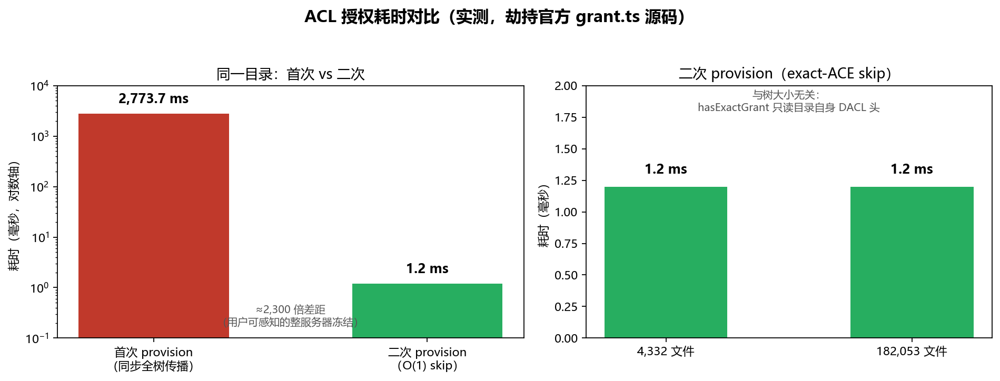
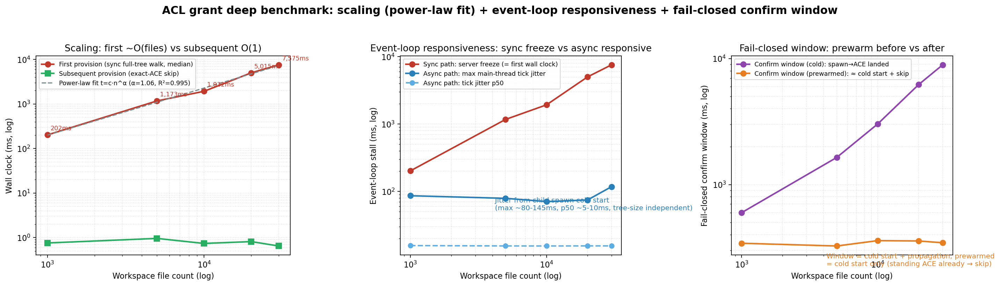

# @topolyte/windows-acl

Windows ACL write-restriction sandbox provider for [DeepSeek Harness](https://github.com/deepseek-ai/deepseek-harness)
with **non-blocking workspace-grant materialization**.

The official windows-acl backend materializes a workspace's standing write ACE
synchronously inside `confine()`: on a large workspace the eager
inheritable-ACE propagation (`SetNamedSecurityInfoW`) walks the whole tree for
minutes **on the Node event loop**, freezing the entire server (all sessions,
HTTP, RPC) on first use. This package fixes that — the tree walk runs in a
`grant-cli` child process, fire-and-forget, so the first provision never
freezes a command spawn.

Installs on the **official** harness as a `ctx.sandbox` replacement via the
Cordis bundle-patch mechanism — **no fork required**.

## What it does

- **Non-blocking authorization** — the workspace's standing write ACE is
  materialized out-of-band by a `grant-cli` child process (`spawn`, not
  `spawnSync`); concurrent first-time calls for one workspace coalesce onto a
  single helper spawn, and workspace roots are canonicalized
  (`realpathSync.native`, per the official `workspaceWriteSid` contract) so
  every spelling of one directory shares one in-flight grant, one SID, and one
  failure counter.
- **Fail-closed, no early child starts** — a workspace-write command is not
  started until its grant is confirmed: while the grant
  is `preparing` or `failed`, `confine()` refuses with `SandboxUnavailableError`
  (never a freeze, never a silent half-authorized run); once it stands, the
  exact-ACE skip makes every later provision O(1).
- **Standing / revocable lifecycle preserved** — the workspace ACE is the
  cross-session reuse cache (never revoked); each session/workspace pair gets a
  random private temp directory with its own capability SID, revoked on
  provider dispose.
- **`prewarm` config** — start the walk at boot for known workspaces, shrinking
  the fail-closed window before the first command.
- **Bounded retry** — a per-workspace consecutive-failure counter
  (`maxGrantRetries`, default 3): past the cap the workspace is pinned to
  `failed` and automatic retries stop (fail-closed, never a freeze); an
  operator or agent resets it with `retryWorkspaceGrant`.
- **Explicit grant state** — `workspaceGrantState(root)` reports
  `preparing` / `ready` / `failed`, so agents/executors can distinguish states
  instead of guessing.
- **Settle-aware shutdown** — provider dispose waits for every in-flight
  grant-cli helper to settle before revoking temp ACEs, so a helper still
  walking the tree is never orphaned or revoked mid-flight.
- Built on the official `@deepseek-ai/dsh-sandbox-windows-acl` primitives
  (`AclWriteGrant`, `workspaceWriteSid`, `tempWriteSid`) and the official
  `SandboxProvider` base class — the full official sandbox semantics are
  inherited.

## Install

From the npm registry (after `npm publish` — the same one-liner as any plugin):

```sh
dsh plugin --profile <name> add @topolyte/windows-acl
```

From a GitHub release tarball (no registry needed — download the `.tgz`
attached to the release):

```sh
dsh plugin --profile <name> add topolyte-windows-acl-0.2.0.tgz
```

From a local checkout:

```sh
dsh plugin --profile <name> add /path/to/@topolyte/windows-acl
```

The bundle's `cordis.patch.yml` disables the official `@deepseek-ai/dsh-sandbox-local`
row and inserts this provider under its own id (`topolyte-sandbox`), so it
becomes the only live `ctx.sandbox` service. Configure the workspaces to
pre-warm at boot:

```yaml
- insert:
    - id: sandbox
      name: '@topolyte/windows-acl'
      config:
        prewarm:
          - C:/path/to/your/workspace
```

## How it works

```
tool-pwsh / tool-bash
  └─ confine() ──► TopolyteWindowsAclProvider (extends SandboxProvider)
       ├─ kickOffWorkspaceGrant(root)      spawn grant-cli child (never awaited)
       │     └─ grant-cli: AclWriteGrant.add(root, standing)  ← full-tree walk HERE
       ├─ workspaceGrantState(root)        preparing / ready / failed
       │     └─ not ready → SandboxUnavailableError (command not started)
       └─ runner argv: --workspace --temp --mode --write-sid --temp-write-sid
```

The expensive `grantWrite → SetNamedSecurityInfoW` eager inheritance walk runs
in the `grant-cli` child process, so the harness event loop never blocks.

## Grant lifecycle (preparing / ready / failed)

The out-of-process design is a state-machine change (per the community repair
invariants in the [DeepSeek Harness Handbook](https://sandbaseai.github.io/deepseek-harness-handbook/windows-acl-first-run.html)):
no child may run before the grant is confirmed. Each workspace root moves
through three explicit states, exposed via `workspaceGrantState(root)`:

```mermaid
stateDiagram-v2
    [*] --> preparing: kickOffWorkspaceGrant (grant-cli child spawned)
    preparing --> ready: helper exit 0 → standing ACE stands
    preparing --> failed: helper exit 127 × maxGrantRetries
    failed --> preparing: retryWorkspaceGrant() resets the counter
    ready --> ready: exact-ACE skip (O(1) per command)
    ready --> [*]: provider dispose (standing ACE stays; temp ACEs revoked)
```



- `preparing` — the grant is walking in the background (minutes on a large
  tree); `confine()` refuses to start the command with `SandboxUnavailableError`.
  Agents either retry, `await ensureWorkspaceGrant(root)`, or rely on a
  `prewarm`ed workspace that was started at boot.
- `ready` — the standing ACE is confirmed; every later provision hits the
  exact-ACE skip and is O(1).
- `failed` — `maxGrantRetries` consecutive grant failures (default 3) pin the
  workspace here: automatic retries stop and commands stay refused until an
  operator or agent calls `retryWorkspaceGrant(root)`.

## Measured impact





Measured on synthetic trees (1k–30k files, rounds=7, first-add measured on 3
independent dirs per scale; `scripts/bench-acl-deep.ts`, raw report
`docs/bench-acl-deep.json`). To cross-validate on a real monorepo (e.g. the
deepseek-harness checkout itself), run
`pnpm exec node --import tsx/esm scripts/bench-acl-deep.ts --real <path> --report docs/bench-acl-deep-real.json`
— note it writes a standing write ACE (never revoked) to that directory.

| Files | Sync first median (server freeze) | First min/max | Subsequent median (skip) | Async stall max / p50 | Confirm cold (fail-closed window) | Confirm prewarmed |
| --- | --- | --- | --- | --- | --- | --- |
| 1,000 | 202.2ms | 196.1/245.3 | 0.8ms | 86.5/15.7ms | 597.7ms | 342.1ms |
| 5,000 | 1,173.2ms | 974.7/1,237.0 | 1.0ms | 79.1/15.5ms | 1,641.1ms | 325.3ms |
| 10,000 | 1,931.8ms | 1,862.4/2,470.9 | 0.7ms | 70.9/15.5ms | 3,027.8ms | 358.8ms |
| 20,000 | 5,015.3ms | 4,511.1/5,314.1 | 0.8ms | 74.8/15.6ms | 6,223.8ms | 356.7ms |
| 30,000 | 7,574.6ms | 7,241.8/8,072.1 | 0.6ms | 117.6/15.6ms | 8,919.4ms | 345.1ms |

- The sync first provision follows a **power law t = 0.133·n^1.06 (R² = 0.995)**
  — statistically ~O(file count) — and is a whole-server freeze: a 5ms
  `setInterval` fires ZERO times for the duration.
- Every later provision is flat at **0.6–1.0ms median** (exact-ACE skip),
  tree-size independent — the gap a user feels grows from ~250x at 1k files to
  ~12,600x at 30k. Honest caveat: the skip is not strict O(1) — roughly 1 in
  10–20 later provisions falls back to the full-tree merge path (the
  `hasExactGrant` implausible-ACL guard) and takes ~the first-add wall clock
  again. On the official sync path that tail is a server freeze on the event
  loop; with this package it happens inside the `grant-cli` child, so the
  server's responsiveness is unaffected either way.
- With this package the same first-tree walk runs in the `grant-cli` child; the
  server's largest event-loop gap is ~70–120ms (child-spawn cold start, p50
  flat at ~15ms) and does **not** grow with tree size.
- **Fail-closed confirm window**: while the grant is `preparing`, `confine()`
  refuses the command (`SandboxUnavailableError`). That refusal lasts
  `confirm cold` — child spawn + full-tree propagation (0.6s at 1k → 8.9s at
  30k), all off the event loop. A `prewarm`ed workspace (standing ACE already
  landed) cuts it to `confirm prewarmed`, a flat ~325–360ms of Node/tsx cold
  start with the tree walk skipped — tree-size independent.

### Why (the mechanism behind the numbers)

- `grant.add(root, true)` calls `SetNamedSecurityInfoW` with OI|CI inheritance.
  The kernel **eagerly re-applies the inheritable ACE to every live
  descendant** — one synchronous call, linear in file count, on the event
  loop. That is the freeze.
- The exact-root-ACE skip (`hasExactGrant`) is not an optimization but a guard:
  re-applying the identical ACE would re-trigger the same O(n) walk. When the
  guard misses it re-walks (see the long-tail caveat above).
- Moving the walk into the `grant-cli` child (`spawn`, not `spawnSync`) keeps
  that O(n) cost off the event loop; the main thread only pays the spawn
  syscall (~70–120ms, p50 ~15ms), regardless of tree size.

## Test

```sh
# unit tests
pnpm --filter @topolyte/windows-acl exec vitest run

# real end-to-end (ACL semantics via icacls; spawns real grant-cli + runner)
pnpm --filter @topolyte/windows-acl exec node --import tsx/esm scripts/e2e-acl.ts
```

## Why not a fork / PR

The upstream maintainers are aware of the ACL cost (see the "eager inheritance;
minutes on large workspaces" note in the official `acl.ts`) but do not accept
PRs. This package ships the same fix as an independent, installable plugin so
any official-harness user gets the non-blocking behavior without maintaining a
fork.

## Third-party notices

This package builds on, and in no way modifies, the following upstream projects
(their licenses apply to the linked sources, not to this package's own code):

- [DeepSeek Harness](https://github.com/deepseek-ai/deepseek-harness) (MIT) —
  `SandboxProvider` base class and the `dsh` plugin/bundle runtime this plugin
  plugs into (`@deepseek-ai/dsh-sandbox`, `@deepseek-ai/dsh-sandbox-windows-acl`,
  `@deepseek-ai/dsh-sandbox-local`).
- [Cordis](https://github.com/cordiverse/cordis) (MIT) — the plugin/bundle
  container (`ctx`, `plugin`, bundle-patch layers).
- [koffi](https://github.com/Koromix/rygel) (MIT) — the FFI layer used by the
  upstream windows-acl backend for `SetNamedSecurityInfoW`; not a direct
  dependency here but transitively exercised by the ACL primitives we reuse.
- [Win32 API `SetNamedSecurityInfoW`](https://learn.microsoft.com/en-us/windows/win32/api/aclapi/nf-aclapi-setnamedsecurityinfow)
  — Microsoft docs reference for the inherited-ACE propagation semantics this
  fix avoids.

All reuse is via the official packages' published public APIs and type
declarations; no upstream source is vendored or copied into this repository.

## Contributing

Contributions are welcome but should stay within the package's narrow scope:
non-blocking Windows ACL sandboxing for DeepSeek Harness. Before opening a PR,
please:

1. Keep every change on a real code path — no empty skeletons, no
   `not-implemented` stubs, no hardcoded values.
2. Preserve the fail-closed invariant: a missing standing ACE must deny, never
   freeze, and never silently widen the grant.
3. Add or update tests: unit tests (`vitest run`) and, for ACL semantics, the
   real end-to-end script (`scripts/e2e-acl.ts`, Win32-only, asserts via
   `icacls`).
4. Verify with `pnpm --filter @topolyte/windows-acl exec vitest run` before
   submitting.

Report bugs and upstream concerns via GitHub issues rather than forks; this
package deliberately avoids forking the official harness.

## License

MIT
